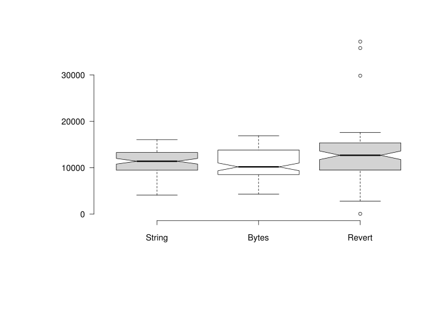

# Calibration
* Scope
* In-process HTTP server

## Scope

One tricky part of planning load test or benchmark is deciding how much 'load'
can be generated by one of the load testing clients, that is how many clients
do we need to set up. Or, most simply, how much load can one client simulate.
Things are complicated by inter-relations between requests/second, request size,
bandwidth, server response timing and server response size.

Our calibration exercise aims to give you a starting point for your
calculations.  That point is an approximation of the neighborhood of the
maximum requests/second that could be generated by the machine running Regatta.

The context, or constraints, are:

* We setup a localhost HTTP server on port `8888`.
* The server responds with `"Hello World!"`.
* The HTTP client makes concurrent requests.

This blog post tracks the evolution of the in-process HTTP server setup.

## In-process HTTP server

The server process is gracfully shutdown when the calibration is completed,
or when the user signals `ctl-c` , or some shut instruction.
We will document the gracefully shutdown elsewhere, so we can set that aside.

Initially a new HTTP server was spawned on each iteration of the Criterion
benchmarks.  Apart from being messy, this generated system wide load that
we expected to interfere with the req/sec throughput estimates.

Once we moved the server setup to be idempotent we saw a reasonable improvement
in throughput.  Criterion reports benchmark results in terms of time.
The average time taken to process 10K requests declined statistically significantly.

[Single server startup](blog/reports/20210822/relative_pdf_small.svg)

That is all we can take from this [full report](blog/reports/20210822).
The reason is the benchmark host is
a developer desktop, which has several background processes running.
Repeating the benchmark runs with and without this change confirmed these
results are indicative of an improvement.

The range of requests/sec is wide: [5k-16k].  This is due to the host system
running unrelated, non-essential processes.

Before pursuing further improvements we establish if the internal calibration
requests/second results are in the ballpark of results reported by 'similarly'
simple server implementations.  We limit ourselves to the Rust based servers
[kcup (v 0.2.1)] and [miniserve (v 0.14.0)] (sample of 100 simulations each):


Our functionality is simpler than [kcup (v 0.2.1)] and
[miniserve (v 0.14.0)], so we expected higher request/second rates.
We attempted to change the response string into Bytes (static), but that made
no improvement and has been reverted:



## Appendix

### Internal v kcup v miniserve

#### Generate requests/second data

```bash
echo Hello World! >/tmp/test-hello
kcup -f /tmp/test-hello &
miniserve /tmp/test-hello -p 5001 &
cargo bench --package regatta --bench reqs -- calibrate-limit --nocapture &>>internal.log;
for i in {1..100} ;do wrk -t12 -c400 -d2s --latency http://127.0.0.1:5000 &>>kcup.log; done
for i in {1..100} ;do wrk -t12 -c400 -d2s --latency http://127.0.0.1:5001 &>>miniserve.log; done
```

#### Collate requests/second data

```bash
echo internal > int.txt
cat internal.log | grep Throughput:|cut -d' ' -f2|sort >>in.txt
echo kcup >kc.txt
cat kcup.log |grep Requests/sec|cut -d: -f2|sort >>kc.txt
echo miniserve >ms.txt
cat miniserve.log |grep Requests/sec|cut -d: -f2|sort >>ms.txt
pr -tm -s, int.txt kc.txt ms.txt >int-kc-ms.csv
rm int.txt kc.txt ms.txt internal.log kcup.log miniserve.log
```

### Internal: String v Bytes

#### Generate requests/second data

Before the change, and after reverting the change

```bash
cargo bench --package regatta --bench reqs -- calibrate-limit --nocapture &>>internal.log;
cargo bench --package regatta --bench reqs -- calibrate-limit --nocapture &>>internal2b.log;
```

After the change

```bash
cargo bench --package regatta --bench reqs -- calibrate-limit --nocapture &>>internal2.log;
```

#### Collate requests/second data

```bash
echo string > int.txt
cat internal.log | grep Throughput:|cut -d' ' -f2 >>int.txt
echo revert > int2b.txt
cat revert.log | grep Throughput:|cut -d' ' -f2 >>int2b.txt
echo bytes > int2.txt
cat bytes.log | grep Throughput:|cut -d' ' -f2 >>int2.txt

pr -tm -s, int.txt int2.txt int2b.txt >int-int2b-int2.csv

rm int.txt int2b.txt int2.txt internal.log internal2b.log internal2.log
```


[kcup (v 0.2.1)]: https://gitlab.com/mrman/kcup-rust
[miniserve (v 0.14.0)]: https://github.com/svenstaro/miniserve
